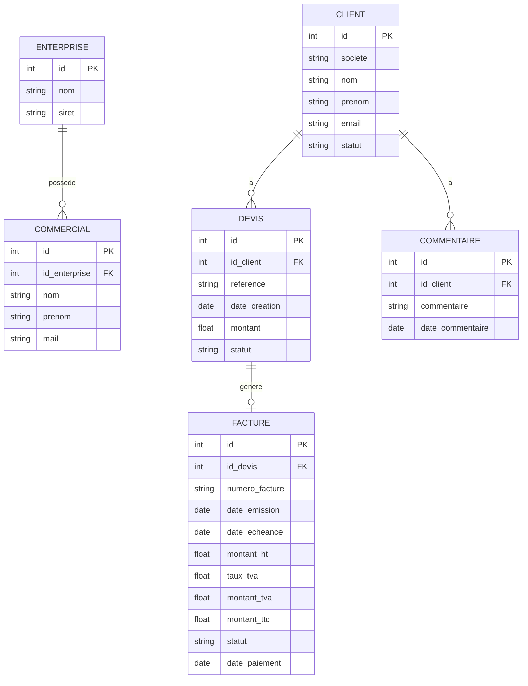
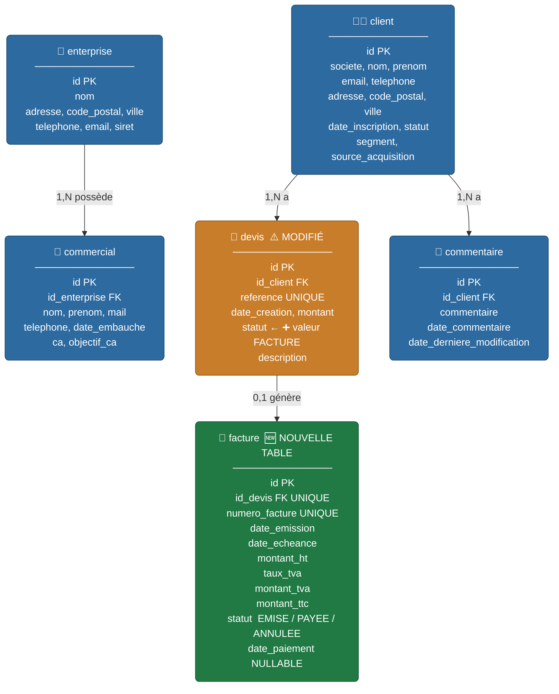

# Évolution — Liaison Facture / Devis Validé

> **BTS SIO SLAM — Analyse d'évolution fonctionnelle (présentation orale)**

---

## Contexte fonctionnel

L'application CRM permet actuellement de créer et de suivre des devis associés à des clients.
Un devis peut avoir plusieurs statuts : en attente, accepté, refusé.

L'évolution demandée consiste à permettre la **transformation d'un devis accepté en facture**,
afin de couvrir le cycle commercial complet : prospection → devis → validation → facturation.

---

## Enjeux juridiques

En France, la facture est un document à valeur légale encadrée par le **Code général des impôts
(article 242 nonies A)** et le **Code de commerce (article L.441-9)**.

### Mentions obligatoires sur une facture

| Mention                     | Détail                                                |
| --------------------------- | ----------------------------------------------------- |
| Numéro de facture           | Unique, séquentiel et chronologique (non modifiable)  |
| Date d'émission             | Date à laquelle la facture est générée                |
| Identité du vendeur         | Nom, adresse, SIRET, numéro de TVA intracommunautaire |
| Identité de l'acheteur      | Nom, adresse de facturation                           |
| Description des prestations | Nature, quantité et prix unitaire                     |
| Montant HT, TVA et TTC      | Taux de TVA applicable détaillé                       |
| Date d'échéance             | Date limite de paiement                               |
| Pénalités de retard         | Mention obligatoire des intérêts en cas de retard     |
| Escompte                    | Conditions d'escompte si applicable                   |

### Contraintes juridiques et d'intégrité

- **Une facture émise ne peut pas être modifiée** : toute correction passe obligatoirement par un avoir.
- **La numérotation doit être séquentielle sans trou** : aucun numéro ne peut être sauté ou réutilisé.
- **Conservation obligatoire** : 10 ans (article L.123-22 du Code de commerce).
- **Facturation électronique** : depuis 2024-2026, obligation progressive pour les entreprises
  françaises de transmettre les factures via une plateforme homologuée (ex. Chorus Pro).
  Dans le cadre d'une application locale offline, cette contrainte est hors périmètre immédiat
  mais doit être anticipée pour une future évolution connectée.
- **Immutabilité applicative** : le statut `EMISE` d'une facture doit bloquer toute modification
  du montant ou de la description du devis associé au niveau du service et du DAO.

---

## Modification du schéma de base de données

### Nouvelle table `facture`

| Colonne          | Type    | Contrainte                              |
| ---------------- | ------- | --------------------------------------- |
| `id`             | INTEGER | PRIMARY KEY AUTOINCREMENT               |
| `id_devis`       | INTEGER | FK → `devis.id` UNIQUE NOT NULL         |
| `numero_facture` | TEXT    | UNIQUE NOT NULL                         |
| `date_emission`  | TEXT    | NOT NULL (format ISO 8601 : YYYY-MM-DD) |
| `date_echeance`  | TEXT    | NOT NULL                                |
| `montant_ht`     | REAL    | NOT NULL                                |
| `taux_tva`       | REAL    | NOT NULL (ex : 20.0)                    |
| `montant_tva`    | REAL    | NOT NULL                                |
| `montant_ttc`    | REAL    | NOT NULL                                |
| `statut`         | TEXT    | NOT NULL (EMISE / PAYEE / ANNULEE)      |
| `date_paiement`  | TEXT    | NULLABLE                                |

> La contrainte `UNIQUE` sur `id_devis` garantit qu'un devis ne peut générer **qu'une seule facture**.
> La suppression en cascade (`ON DELETE CASCADE`) sur `devis` est **bloquée** dès qu'une facture est liée : c'est une règle métier à appliquer côté service.

### Évolution de la table `devis`

Aucun ajout de colonne n'est nécessaire. En revanche, le statut `ACCEPTE` devient le **déclencheur
métier** autorisant la création d'une facture. Un nouveau statut `FACTURE` doit être ajouté à
l'enum `StatutDevis` pour indiquer qu'un devis a déjà été converti.

### Schéma relationnel mis à jour



---

## Influence sur la base de données

### Nouvelles dépendances entre tables

- `facture` dépend de `devis`, qui dépend lui-même de `client`.
- La suppression en cascade `ON DELETE CASCADE` existante sur `devis → client` doit être
  **conditionnée** : si une facture existe pour ce devis, la suppression doit être **bloquée**
  au niveau du service avant toute tentative en base.

### Génération du numéro de facture

Le numéro de facture est généré côté applicatif selon un format normalisé :

```
FACT-{ANNEE}-{NUMERO_SEQUENTIEL_4_CHIFFRES}
Exemple : FACT-2026-0001
```

Le numéro séquentiel est calculé en récupérant le dernier numéro en base avant insertion,
dans une **transaction atomique SQLite** pour garantir l'unicité même en cas d'appels rapprochés.

### Immutabilité en base

Une fois une facture au statut `EMISE` ou `PAYEE` :

- Aucun `UPDATE` sur les colonnes `montant_*`, `numero_facture`, `id_devis` n'est autorisé.
- Seule la colonne `statut` et `date_paiement` peuvent évoluer (via une méthode dédiée).

---

## Logique métier

### Règles de transformation devis → facture

1. Le devis doit avoir le statut **ACCEPTE** pour pouvoir générer une facture.
2. Un devis ne peut générer **qu'une seule facture** (contrainte UNIQUE en BDD + vérification service).
3. Une fois la facture créée, le statut du devis passe automatiquement à **FACTURE**.
4. Le montant HT de la facture est hérité du montant du devis ; la TVA est calculée automatiquement.
5. Une facture au statut **EMISE** ou **PAYEE** est **immuable** : aucune modification des montants.
6. L'annulation ne supprime pas la facture : le statut passe à **ANNULEE** (traçabilité conservée).

### Évolution de l'enum `StatutDevis`

```
EN_ATTENTE  ──►  ACCEPTE  ──►  FACTURE
                    │
                    └──►  REFUSE
```

### Cycle de vie d'une facture

```
[Devis ACCEPTE]
      │
      │  action : "Générer la facture"
      ▼
[Facture EMISE]  ──►  [Facture PAYEE]
      │
      └──────────────►  [Facture ANNULEE]
```

---

## Impacts sur les couches applicatives

### Couche `model`

| Élément                   | Évolution                                     |
| ------------------------- | --------------------------------------------- |
| Nouvelle classe `Facture` | Champs correspondant aux colonnes de la table |
| Enum `StatutFacture`      | `EMISE`, `PAYEE`, `ANNULEE`                   |
| Enum `StatutDevis`        | Ajout de la valeur `FACTURE`                  |

### Couche `dao`

| Élément      | Évolution                                                                     |
| ------------ | ----------------------------------------------------------------------------- |
| `FactureDAO` | `insert`, `findById`, `findByDevisId`, `findAll`, `updateStatut`              |
| `DevisDAO`   | Vérification d'existence d'une facture liée avant autorisation de suppression |

### Couche `service`

| Élément          | Évolution                                                          |
| ---------------- | ------------------------------------------------------------------ |
| `FactureService` | `genererFacture(Devis)`, `marquerPayee(int id)`, `annuler(int id)` |
| `DevisService`   | Blocage de la suppression si une facture est liée                  |

La méthode `genererFacture` devra :

1. Vérifier le statut `ACCEPTE` du devis.
2. Vérifier qu'aucune facture n'existe déjà pour ce devis.
3. Générer le numéro séquentiel dans une transaction.
4. Calculer les montants TVA et TTC.
5. Persister la facture.
6. Mettre à jour le statut du devis à `FACTURE`.

### Couche `validation`

| Élément            | Évolution                                                                                                |
| ------------------ | -------------------------------------------------------------------------------------------------------- |
| `FactureValidator` | Taux TVA compris entre 0 et 100, date d'échéance postérieure à la date d'émission, cohérence montant TTC |

### Couche `view / controller`

| Élément                     | Évolution                                                            |
| --------------------------- | -------------------------------------------------------------------- |
| Vue détail devis (modifiée) | Bouton "Générer la facture" visible uniquement si statut = `ACCEPTE` |
| Nouvelle vue liste factures | Tableau : numéro, client, montant TTC, statut, date échéance         |
| Nouvelle vue détail facture | Lecture seule, avec toutes les mentions légales affichées            |

---

## Pistes interface — Front / Figma

Si une maquette Figma est réalisée pour illustrer l'évolution, les écrans à concevoir sont :

| Écran                  | Description                                                               |
| ---------------------- | ------------------------------------------------------------------------- |
| Détail devis (modifié) | Bouton "Générer la facture" conditionnel au statut `ACCEPTE`              |
| Liste des factures     | Tableau filtrable avec numéro, client, montant TTC, statut, échéance      |
| Détail facture         | Vue en lecture seule avec toutes les mentions légales obligatoires        |
| Modale de confirmation | Confirmation avant génération : affichage du récapitulatif avant création |

---

## Sécurité et bonnes pratiques

| Point de vigilance       | Mesure                                                                          |
| ------------------------ | ------------------------------------------------------------------------------- |
| Immutabilité             | Blocage au niveau du `service` ET du `DAO`, pas seulement dans l'UI             |
| Intégrité référentielle  | Vérification avant suppression d'un devis lié à une facture                     |
| Numérotation atomique    | Transaction SQLite pour éviter tout doublon de numéro de facture                |
| Pas de données sensibles | Montants stockés en `REAL`, jamais en `TEXT` pour éviter les erreurs de tri     |
| Traçabilité              | Aucune suppression physique de facture : passage en statut `ANNULEE` uniquement |
| Injection SQL            | Utilisation de requêtes paramétrées (PreparedStatement) — déjà en place         |

---

## Résumé des évolutions prévues

| Composant         | Évolution                                                       |
| ----------------- | --------------------------------------------------------------- |
| BDD               | Nouvelle table `facture`, nouveau statut `FACTURE` dans `devis` |
| `model`           | Classe `Facture`, enum `StatutFacture`, màj `StatutDevis`       |
| `dao`             | `FactureDAO`, màj `DevisDAO`                                    |
| `service`         | `FactureService`, màj `DevisService`                            |
| `validation`      | `FactureValidator`                                              |
| `view/controller` | Vue liste factures, vue détail facture, màj vue détail devis    |
| Juridique         | Mentions obligatoires, numérotation séquentielle, immutabilité  |
| UI / Figma        | 4 écrans à concevoir (détail devis, liste, détail, modale)      |

---

## Schéma BDD complet avec code couleur

> **Légende :**
>
> - 🟦 **Bleu** — table existante, aucune modification
> - 🟧 **Orange** — table existante **modifiée** (ajout d'une valeur d'enum)
> - 🟩 **Vert** — **nouvelle table** créée pour cette évolution



---

## Liste exhaustive des fichiers à créer et à modifier

### Nouveaux fichiers à créer

> Chaque nouveau fichier suit le même pattern que les fichiers existants du même type,
> ce qui garantit la **cohérence architecturale** et facilite la maintenance.

#### Couche `model`

| Fichier à créer                          | Raison du choix                                                                                                                                                                                                               |
| ---------------------------------------- | ----------------------------------------------------------------------------------------------------------------------------------------------------------------------------------------------------------------------------- |
| `src/main/java/model/Facture.java`       | Classe Java représentant la table `facture`. Même structure que `Devis.java` ou `Client.java` : champs privés, constructeur, getters/setters. Indispensable pour faire circuler les données entre DAO, service et contrôleur. |
| `src/main/java/model/StatutFacture.java` | Enum `EMISE`, `PAYEE`, `ANNULEE`. Même principe que `StatutDevis.java` déjà existant. Centralise les valeurs autorisées et évite les chaînes de caractères libres dans le code.                                               |

#### Couche `exception`

| Fichier à créer                                         | Raison du choix                                                                                                                                                            |
| ------------------------------------------------------- | -------------------------------------------------------------------------------------------------------------------------------------------------------------------------- |
| `src/main/java/exception/FactureNotFoundException.java` | Exception levée quand une facture demandée n'existe pas en base. Même contrat que `DevisNotFoundException.java`. Permet des messages d'erreur précis via `UiErrorHandler`. |
| `src/main/java/exception/FactureAssertException.java`   | Exception levée lors d'une violation de règle métier sur une facture (ex : tentative de modification d'une facture émise). Même principe que `DevisAssertException.java`.  |

#### Couche `util`

| Fichier à créer                             | Raison du choix                                                                                                                                                                                                                          |
| ------------------------------------------- | ---------------------------------------------------------------------------------------------------------------------------------------------------------------------------------------------------------------------------------------- |
| `src/main/java/util/SqlRequestFacture.java` | Centralise toutes les requêtes SQL liées à `facture` (constantes de type `String`). Même approche que `SqlRequestDevis.java`. Séparation claire entre le SQL et la logique Java : facilite la lisibilité et les corrections de requêtes. |

#### Couche `dao`

| Fichier à créer                      | Raison du choix                                                                                                                                                                              |
| ------------------------------------ | -------------------------------------------------------------------------------------------------------------------------------------------------------------------------------------------- |
| `src/main/java/dao/IFactureDAO.java` | Interface définissant le contrat du DAO. Même pattern que `IDevisDao.java`. Permet de mocker le DAO dans les tests unitaires (Mockito).                                                      |
| `src/main/java/dao/FactureDAO.java`  | Implémentation concrète : `insert`, `findById`, `findByDevisId`, `findAll`, `updateStatut`. Même structure que `DevisDAO.java`. Utilise des `PreparedStatement` pour éviter l'injection SQL. |

#### Couche `service`

| Fichier à créer                              | Raison du choix                                                                                                                                                                                                                                  |
| -------------------------------------------- | ------------------------------------------------------------------------------------------------------------------------------------------------------------------------------------------------------------------------------------------------ |
| `src/main/java/service/IFactureService.java` | Interface du service. Même pattern que `IDevisService.java`. Découple la vue du service concret.                                                                                                                                                 |
| `src/main/java/service/FactureService.java`  | Logique métier : `genererFacture(Devis)`, `marquerPayee(int)`, `annuler(int)`. Contient toutes les vérifications (statut devis, unicité, calcul TVA, génération du numéro). C'est ici que se concentre la protection de l'intégrité des données. |

#### Couche `validation`

| Fichier à créer                                            | Raison du choix                                                                                                                                                                                             |
| ---------------------------------------------------------- | ----------------------------------------------------------------------------------------------------------------------------------------------------------------------------------------------------------- |
| `src/main/java/validation/validator/FactureValidator.java` | Validateur centralisé en méthodes statiques. Même pattern que `DevisValidator.java`. Vérifie : taux TVA entre 0 et 100, date d'échéance postérieure à la date d'émission, cohérence montant TTC = HT + TVA. |

#### Couche `view/controller`

| Fichier à créer                                                             | Raison du choix                                                                                                                                                                                          |
| --------------------------------------------------------------------------- | -------------------------------------------------------------------------------------------------------------------------------------------------------------------------------------------------------- |
| `src/main/java/view/controller/liste_factures/ControllerListeFactures.java` | Contrôleur de la vue liste des factures. Même structure que `ControllerListeDevis.java`. Charge et affiche toutes les factures via le service.                                                           |
| `src/main/java/view/controller/detail_facture/ControllerDetailFacture.java` | Contrôleur de la vue détail facture. Vue en **lecture seule** : les champs sont non modifiables. Affiche les mentions légales. Propose les actions "Marquer payée" et "Annuler" conditionnées au statut. |

#### Couche `resources/view`

| Fichier à créer                                              | Raison du choix                                                                                                                                                                                                         |
| ------------------------------------------------------------ | ----------------------------------------------------------------------------------------------------------------------------------------------------------------------------------------------------------------------- |
| `src/main/resources/view/liste_factures/liste_factures.fxml` | Vue FXML de la liste des factures. Même structure que `liste_devis.fxml` : `TableView` avec colonnes numéro, client, montant TTC, statut, échéance.                                                                     |
| `src/main/resources/view/detail_facture/detail_facture.fxml` | Vue FXML de détail d'une facture. Champs en lecture seule. Affiche toutes les informations légales. Boutons conditionnels selon le statut (`EMISE` → boutons "Payée" et "Annuler", `PAYEE` / `ANNULEE` → aucun bouton). |

---

### Fichiers existants à modifier

> Chaque modification est **minimale et ciblée** pour ne pas déstabiliser le code existant.

#### Couche `model`

| Fichier à modifier                     | Modification                             | Raison                                                                                                                                                                                                                                              |
| -------------------------------------- | ---------------------------------------- | --------------------------------------------------------------------------------------------------------------------------------------------------------------------------------------------------------------------------------------------------- |
| `src/main/java/model/StatutDevis.java` | Ajout de la valeur `FACTURE` dans l'enum | Permet de distinguer un devis converti en facture des autres statuts. Sans ce marqueur, il serait impossible de savoir si un devis a déjà été facturé sans interroger la table `facture`. Choix de l'enum : cohérence avec le pattern déjà utilisé. |

#### Couche `util`

| Fichier à modifier               | Modification                                                                                 | Raison                                                                                                                                                                                                      |
| -------------------------------- | -------------------------------------------------------------------------------------------- | ----------------------------------------------------------------------------------------------------------------------------------------------------------------------------------------------------------- |
| `src/main/java/util/InitDB.java` | Ajout du `CREATE TABLE IF NOT EXISTS facture` avec toutes ses colonnes et la FK vers `devis` | C'est le point central d'initialisation de la base. Toutes les tables sont créées ici : ajouter `facture` ici garantit qu'elle sera créée automatiquement au premier lancement, sans intervention manuelle. |

#### Couche `dao`

| Fichier à modifier                | Modification                                                                         | Raison                                                                                                                                                                                                                                                           |
| --------------------------------- | ------------------------------------------------------------------------------------ | ---------------------------------------------------------------------------------------------------------------------------------------------------------------------------------------------------------------------------------------------------------------- |
| `src/main/java/dao/DevisDAO.java` | Ajout d'une méthode `existsFactureForDevis(int idDevis)` ou protection dans `delete` | Avant de supprimer un devis, il faut vérifier qu'aucune facture ne lui est liée. SQLite ne bloque pas automatiquement car la contrainte est portée sur `facture.id_devis`, pas sur `devis`. Le DAO est le bon endroit pour cette vérification proche de la base. |

#### Couche `service`

| Fichier à modifier                        | Modification                                                                                                       | Raison                                                                                                                                                                                  |
| ----------------------------------------- | ------------------------------------------------------------------------------------------------------------------ | --------------------------------------------------------------------------------------------------------------------------------------------------------------------------------------- |
| `src/main/java/service/DevisService.java` | Ajout d'une vérification dans la méthode de suppression : lever une `DevisAssertException` si une facture est liée | Double protection (service + DAO) conforme au pattern du projet. Le service est la couche métier : c'est ici que doit se trouver la règle "un devis facturé ne peut pas être supprimé". |

#### Couche `view/controller`

| Fichier à modifier                                                          | Modification                                                                              | Raison                                                                                                                                                                                                                |
| --------------------------------------------------------------------------- | ----------------------------------------------------------------------------------------- | --------------------------------------------------------------------------------------------------------------------------------------------------------------------------------------------------------------------- |
| `src/main/java/view/controller/liste_devis/ControllerListeDevis.java`       | Ajout d'une colonne action "Générer la facture" visible uniquement si `statut == ACCEPTE` | C'est la vue naturelle pour déclencher la génération : l'utilisateur voit ses devis et peut agir directement sur ceux qui sont acceptés. Évite de créer une vue intermédiaire inutile.                                |
| `src/main/java/view/controller/modifier_devis/ControllerModifierDevis.java` | Blocage des champs de saisie si le statut du devis est `FACTURE`                          | Une fois converti en facture, le devis ne doit plus être modifiable (cohérence avec l'immutabilité de la facture liée). Le contrôleur doit mettre les champs en `setDisable(true)` et afficher un message explicatif. |

#### Couche `resources/view`

| Fichier à modifier                                           | Modification                                                                                             | Raison                                                                                                                                                                  |
| ------------------------------------------------------------ | -------------------------------------------------------------------------------------------------------- | ----------------------------------------------------------------------------------------------------------------------------------------------------------------------- |
| `src/main/resources/view/liste_devis/liste_devis.fxml`       | Ajout d'une colonne ou d'un bouton conditionnel "Générer la facture"                                     | Support visuel du nouveau bouton dans le contrôleur. Sans modification du FXML, le contrôleur n'a pas de composant sur lequel s'appuyer.                                |
| `src/main/resources/view/modifier_devis/modifier_devis.fxml` | Ajout d'un label d'information "Devis converti en facture — modification impossible" (masqué par défaut) | Retour visuel clair pour l'utilisateur lorsque le formulaire est désactivé. Meilleure expérience utilisateur : l'utilisateur comprend pourquoi le formulaire est grisé. |

---

## Synthèse des fichiers

| Type                  | Nombre | Détail                                                                             |
| --------------------- | ------ | ---------------------------------------------------------------------------------- |
| **Nouveaux fichiers** | **12** | 2 model, 2 exception, 1 util, 2 dao, 2 service, 1 validation, 2 controller, 2 fxml |
| **Fichiers modifiés** | **6**  | 1 model, 1 util, 1 dao, 1 service, 2 controller, 2 fxml                            |

> **Justification globale des choix d'architecture :**
> Chaque nouveau fichier reproduit exactement le pattern déjà en place dans le projet
> (interface + implémentation pour DAO et service, enum pour les statuts, validator statique,
> exception dédiée). Ce choix garantit la **cohérence du code**, facilite la **prise en main**
> par un autre développeur et respecte le principe de **responsabilité unique** (chaque classe
> a un rôle précis). Les modifications sur les fichiers existants sont toutes **minimales**
> afin de ne pas introduire de régressions sur les fonctionnalités déjà testées.

"Dans la version actuelle, les factures ne sont jamais supprimées physiquement de la base SQLite. Pour garantir la conservation 10 ans malgré les risques d'une application locale (panne disque, changement de poste), deux évolutions sont prévues : l'export automatique en PDF à la génération de chaque facture, et une sauvegarde automatique du fichier de base au démarrage de l'application. Ces deux mécanismes fonctionnent hors connexion et ne nécessitent pas de serveur."

Synthèse

Risque Solution
Panne disque / perte de crm.db Backup automatique horodaté du fichier SQLite
Suppression accidentelle d'une facture Immutabilité : pas de DELETE, statut ANNULEE uniquement
Changement de poste Export PDF indépendant de la base + dossier sauvegardé sur NAS/cloud
Modification frauduleuse d'une facture Immutabilité en base (service + DAO) + PDF généré à l'émission

Le PDF est la solution la plus solide juridiquement car il constitue une preuve externe et indépendante de la base de données.

question que l'on pourrait se poser

Pas de justification du choix "table séparée vs colonnes dans devis" — c'est la question architecturale centrale. Le jury va demander : "pourquoi ne pas avoir simplement ajouté des colonnes montant_ht, statut_paiement directement dans la table devis ?" Tu n'as pas de réponse écrite.

Pas de justification sur la dénormalisation — tu stockes montant_ht + taux_tva + montant_tva + montant_ttc alors que montant_tva et montant_ttc sont calculables. C'est un choix volontaire (cohérence avec les obligations légales de la facture émise) mais il n'est pas expliqué.

Le PDF est mentionné comme "piste future" mais aucune bibliothèque Java n'est nommée comme candidat (iText, Apache PDFBox), ce qui fragilise la crédibilité technique de la proposition.
