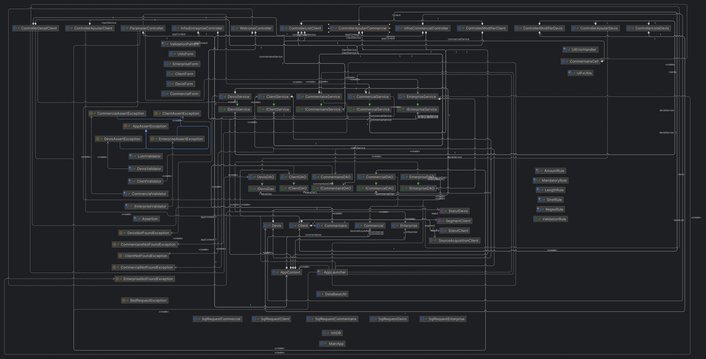

# CRM Desktop Commercial

[lien-rp-CRMcommercial.pdf](lien-rp-CRMcommercial.pdf)

## Description

Ce projet est un **CRM desktop** développé en **Java 21** et **JavaFX 23.0.2**, conçu pour gérer le suivi des **clients**, **prospects** et **devis** d'un commercial.

> Remarque : JavaFX fonctionne sans installation supplémentaire sur ce projet.

L'application utilise **SQLite 3.45.1.0** pour stocker les données en local.  
Pour le moment, elle est conçue pour un **seul commercial** et une **seule entreprise**, sans authentification ni connexion internet.

---

## Structure de l'application

### 1. `util`

- Gestion et initialisation de la base de données
- Requêtes SQL par entité
- Utilitaire pour ouvrir la connexion à la base

### 2. `dao`

- DAO par entité
- Transforme les données de la base en modèles Java (`model`)

### 3. `model`

- Entités : `Commercial`, `Entreprise`, `Client`, `Devis`, `Commentaire`
- Enums associés aux entités

### 4. `service`

- Logique métier
- Appelle les DAO, effectue vérifications et ajustements nécessaires avant mise à jour de la base

### 5. `validation`

- **`rule`** : contient les règles de validation (`MandatoryRule`, `LengthRule`, `RegexRule`, …)
- **`validator`** : méthodes statiques appliquées par les services pour valider les modèles en une ligne
- Exemple : `ClientValidator` applique toutes les règles sur un client et lève une exception si invalidité

### 6. `view`

- **`helper`** : validation réactive des formulaires UI, animations, gestion des erreurs UI
- **`app`** : logique de démarrage, affichage de la vue correspondant à l'état de la BDD, `AppContext` pour stocker commercial et entreprise en mémoire
- **`controller`** : un contrôleur par vue, gère l'UI et les appels aux services, capture les exceptions via `UiErrorHandler` global

### 7. `mainApp.java`

- Point d'entrée de l'application
- Méthodes classiques `main` et `start` de JavaFX

### 8. `resources`

- `application.properties` : URL de la BDD (utile pour tests d'intégration)
- Package `view` : toutes les pages FXML nécessaires à l'application

---

## Tests

- **Unitaires** : DAO, service, validation et utilitaires (~100 tests)
- **UI** : environ 10 tests couvrant partiellement les contrôleurs
- **Intégration** : 1 test vérifiant l'initialisation de la base

**Couverture globale : 76%**, avec les couches métier et DAO mieux couvertes que les contrôleurs.

---

## Commandes utiles

- Lancer l'application :

```bash
mvn javafx:run
```

- Lancer les tests unitaires et générer le rapport Jacoco :

```bash
mvn clean test
```

- Lancer les tests complets avec Surefire (tests d'intégration inclus) :

```bash
mvn verify
```

---

## Remarques et bonnes pratiques

- L'application est **offline**, donc aucune connexion internet n'est nécessaire.
- Actuellement, un **seul commercial** et **une seule entreprise** sont supportés.
- La base SQLite est créée en local automatiquement.
- Les règles de validation sont centralisées pour que le **service et l'UI utilisent les mêmes règles**.
- Tous les fichiers IntelliJ `.idea` et la base `crm.db` ne doivent pas être pushés sur GitHub.
- Préférer **Java 21** pour exécuter l'application ; Java 22 ou supérieur peut fonctionner mais n'a pas été testé.

---

## Architecture



---

## Contribution

- Avant de pousser : vérifier que les fichiers `.idea` et `crm.db` sont ignorés.
- Lancer `mvn clean test` pour vérifier que tous les tests passent.
- Respecter les règles de validation centralisées.
- Pour toute modification de la BDD, mettre à jour les scripts dans `util`.

---
