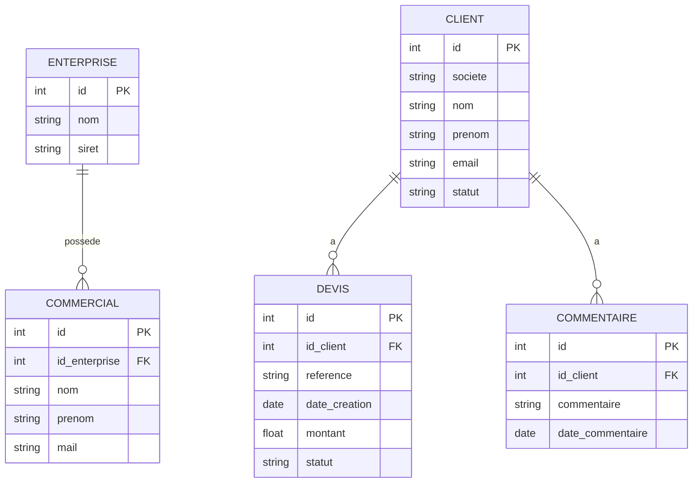

# CRM Desktop Commercial

> **BTS SIO SLAM — Réalisation professionnelle**

---

## Présentation de l'entreprise

L'entreprise fictive dans laquelle s'inscrit cette réalisation est la société **TechniBât Solutions**, une PME spécialisée dans la vente et l'installation de solutions techniques pour le secteur du bâtiment (équipements électriques, systèmes de sécurité et automatisation).

Créée en 2015, l'entreprise est située dans les Hauts-de-France et compte une dizaine de salariés, dont une équipe commerciale chargée de prospecter de nouveaux clients et de suivre les demandes de devis.

L'activité repose principalement sur :

- la gestion d'un portefeuille de clients professionnels (artisans, PME du BTP),
- la réalisation de devis personnalisés,
- le suivi commercial jusqu'à la signature.

---

## Intitulé de la réalisation

Conception et développement d'une application desktop de gestion commerciale (clients, devis, commentaires) pour le suivi quotidien d'un commercial.

---

## Description

Ce projet est un **CRM desktop** développé en **Java 21** et **JavaFX 23.0.2**, conçu pour gérer le suivi des **clients**, **prospects** et **devis** d'un commercial.

> Remarque : JavaFX fonctionne sans installation supplémentaire sur ce projet.

L'application utilise **SQLite 3.45.1.0** pour stocker les données en local.  
Pour le moment, elle est conçue pour un **seul commercial** et une **seule entreprise**, sans authentification ni connexion internet.

---

## Contexte organisationnel

Dans le cadre de la formation BTS SIO option SLAM, la réalisation est placée dans un contexte d'entreprise de taille humaine ayant besoin d'un outil simple, local et fiable pour piloter son activité commerciale.

Le besoin métier principal est de centraliser dans une seule application :

- les informations clients et prospects,
- la création et le suivi des devis,
- les commentaires de suivi commercial,
- les informations de l'entreprise et du commercial.

L'application est pensée pour un fonctionnement local (offline), sans dépendance à Internet, avec une prise en main rapide.

---

## Déclencheur et besoin

Dans le cadre de son développement, TechniBât Solutions a constaté une augmentation du nombre de clients et de demandes de devis. Cependant, le commercial principal de l'entreprise ne dispose pas d'un outil informatique adapté pour gérer efficacement son activité quotidienne. Le suivi des clients et des devis est actuellement réalisé à l'aide de fichiers Excel, de notes personnelles et d'échanges par email.

Cette organisation entraîne plusieurs problématiques :

- une dispersion des informations,
- un risque de perte de données,
- une difficulté à suivre l'historique des échanges avec les clients,
- un manque de visibilité sur l'état d'avancement des devis.

Face à ces limites, la direction souhaite mettre en place une application interne simple, utilisable en local, permettant de centraliser toutes les données commerciales.

Le besoin fonctionnel est de permettre à l'utilisateur de :

- créer, consulter et modifier des clients,
- créer, consulter et modifier des devis,
- associer des commentaires à un client,
- appliquer des règles de validation métier cohérentes,
- conserver les données de façon durable en base locale.

---

## Objectifs de la solution

- Proposer une application desktop stable et exploitable rapidement.
- Couvrir les opérations CRUD sur les données métier (Create, Read, Update, Delete).
- Garantir la qualité des données avec des validations métier centralisées.
- Structurer le code selon le pattern MVC pour faciliter la maintenance et l'évolution.
- Couvrir les composants critiques par des tests automatiques.
- Fournir une base exploitable pour une présentation orale BTS SIO (SLAM).

---

## Périmètre de la réalisation

### Inclus

- Application Java desktop avec interface JavaFX.
- Architecture MVC avec séparation claire entre Modèle, Vue et Contrôleur.
- Base SQLite locale avec initialisation automatique.
- Gestion CRUD des clients, devis, commentaires, entreprise, commercial.
- Jeux de tests unitaires, UI et d'intégration.

### Hors périmètre

- Multi-utilisateur complet avec authentification et gestion de rôles.
- Synchronisation cloud, API web publique, déploiement serveur.
- Gestion multi-entreprises et multi-commerciaux (la version actuelle cible 1 commercial / 1 entreprise).

---

## Contraintes

### Contraintes fonctionnelles

- Intégrité des données métier (formats, champs obligatoires, longueurs, montants).
- Cohabitation entre règles UI et règles métier sans duplication incohérente.
- Navigation simple entre les écrans de création, liste, détail et modification.

### Contraintes techniques

- Java 21.
- JavaFX 23.0.2.
- Maven.
- SQLite (driver `sqlite-jdbc` 3.45.1.0).
- Tests avec JUnit 5, Mockito, TestFX.
- Qualité et couverture avec JaCoCo.

### Contraintes organisationnelles

- Réalisation individuelle.
- Code testable et démontrable en local.
- Documentation exploitable pour l'oral.

---

## Structure de l'application

### 1. `util`

- Gestion et initialisation de la base de données
- Requêtes SQL par entité
- Utilitaire pour ouvrir la connexion à la base

### 2. `dao`

- DAO par entité
- Transforme les données de la base en modèles Java (`model`)

### 3. `model`

- Entités : `Commercial`, `Entreprise`, `Client`, `Devis`, `Commentaire`
- Enums associés aux entités

### 4. `service`

- Logique métier
- Appelle les DAO, effectue vérifications et ajustements nécessaires avant mise à jour de la base

### 5. `validation`

- **`rule`** : contient les règles de validation (`MandatoryRule`, `LengthRule`, `RegexRule`, …)
- **`validator`** : méthodes statiques appliquées par les services pour valider les modèles en une ligne
- Exemple : `ClientValidator` applique toutes les règles sur un client et lève une exception si invalidité

### 6. `view`

- **`helper`** : validation réactive des formulaires UI, animations, gestion des erreurs UI
- **`app`** : logique de démarrage, affichage de la vue correspondant à l'état de la BDD, `AppContext` pour stocker commercial et entreprise en mémoire
- **`controller`** : un contrôleur par vue, gère l'UI et les appels aux services, capture les exceptions via `UiErrorHandler` global

### 7. `mainApp.java`

- Point d'entrée de l'application
- Méthodes classiques `main` et `start` de JavaFX

### 8. `resources`

- `application.properties` : URL de la BDD (utile pour tests d'intégration)
- Package `view` : toutes les pages FXML nécessaires à l'application

---

## CRUD métier implémenté

Le projet met en œuvre le principe CRUD sur les principales entités métier.

| Entité        | Create | Read               | Update | Delete |
| ------------- | ------ | ------------------ | ------ | ------ |
| `Client`      | ✓      | ✓ (liste + détail) | ✓      | ✓      |
| `Devis`       | ✓      | ✓ (liste + détail) | ✓      | ✓      |
| `Commentaire` | ✓      | ✓                  | ✓      | ✓      |
| `Commercial`  | ✓      | ✓                  | ✓      | ✓      |
| `Enterprise`  | ✓      | ✓                  | ✓      | ✓      |

---

## Schéma de base de données

Le schéma est basé sur 5 tables principales.

### Table `enterprise` (entité `Enterprise`)

- `id` (PK)
- `nom`, `adresse`, `code_postal`, `ville`, `telephone`, `email`, `siret`

### Table `commercial` (entité `Commercial`)

- `id` (PK)
- `id_enterprise` (FK → `enterprise.id`)
- `nom`, `prenom`, `mail`, `telephone`, `date_embauche`, `ca`, `objectif_ca`

### Table `client` (entité `Client`)

- `id` (PK)
- `societe`, `nom`, `prenom`, `email`, `telephone`, `adresse`, `code_postal`, `ville`, `pays`
- `date_inscription`, `statut`, `date_derniere_modification`, `segment`, `source_acquisition`

### Table `devis` (entité `Devis`)

- `id` (PK)
- `id_client` (FK → `client.id`)
- `reference` (UNIQUE), `date_creation`, `montant`, `statut`, `description`

### Table `commentaire` (entité `Commentaire`)

- `id` (PK)
- `id_client` (FK → `client.id`)
- `commentaire`, `date_commentaire`, `date_derniere_modification`

### Liaisons

- `enterprise` 1,N `commercial`
- `client` 1,N `devis`
- `client` 1,N `commentaire`
- Les relations `devis` et `commentaire` vers `client` sont définies avec suppression en cascade (`ON DELETE CASCADE`).

### Schéma relationnel



---

## Architecture


---

## Tests

- **Unitaires** : DAO, service, validation et utilitaires (~100 tests)
- **UI** : environ 10 tests couvrant partiellement les contrôleurs
- **Intégration** : 1 test vérifiant l'initialisation de la base

**Couverture globale : 76%**, avec les couches métier et DAO mieux couvertes que les contrôleurs.

---

## Méthode de réalisation

### Phase 1 — Cadrage et architecture

- Identification du besoin métier CRM.
- Définition des entités (Client, Devis, Commentaire, Commercial, Enterprise).
- Choix d'une architecture MVC (Modèle, Vue, Contrôleur).

### Positionnement MVC dans le projet

- **Modèle (M)** : entités métier (`model`), règles métier et validations, persistance SQLite.
- **Vue (V)** : interfaces FXML et composants visuels JavaFX.
- **Contrôleur (C)** : classes `view/controller/...` qui pilotent les actions utilisateur et orchestrent le flux vers le modèle.

### Phase 2 — Socle technique

- Initialisation du projet Maven.
- Configuration JavaFX et dépendances de test.
- Mise en place de SQLite et de l'initialisation de base.

### Phase 3 — Fonctionnalités métier

- Implémentation des cas d'usage clients et devis.
- Ajout du suivi par commentaires.
- Gestion des exceptions métier dédiées.

### Phase 4 — Interface utilisateur

- Écrans FXML pour ajout, liste, détail, modification.
- Contrôleurs JavaFX reliés aux services.
- Helpers UI pour validation réactive et gestion d'erreurs.

### Phase 5 — Qualité et validation

- Tests unitaires DAO, services, validation.
- Tests UI sur les contrôleurs principaux.
- Test d'intégration sur l'initialisation de la base.
- Mesure de couverture (environ 76% actuellement).

### Phase 6 — Livraison et soutenance

- Stabilisation technique.
- Rédaction de la documentation.
- Préparation du support de démonstration orale.

---

## Missions réalisées personnellement

Dans le cadre de ce projet, j'interviens en tant que développeur unique. J'ai pris en charge l'ensemble du cycle de réalisation, de l'analyse du besoin jusqu'à la validation de la solution.

### Mission A — Conception technique

- Conception de l'architecture logicielle en MVC.
- Structuration des packages métier et UI.

### Mission B — Développement métier et données

- Création des modèles de domaine.
- Développement des DAO et des requêtes SQL.
- Développement des services métier.

### Mission C — Validation et robustesse

- Création des règles de validation (`MandatoryRule`, `LengthRule`, `RegexRule`, `AmountRule`, `SiretRule`).
- Mise en place des validateurs métier centralisés.
- Gestion des erreurs via des exceptions dédiées et `UiErrorHandler`.

### Mission D — IHM JavaFX

- Création des vues FXML et des contrôleurs pour :
  - Ajout client, ajout devis, ajout commercial,
  - Liste clients et liste devis,
  - Détail client,
  - Modification client et devis,
  - Écrans informations entreprise/commercial, menu, accueil.

### Mission E — Tests et qualité

- Écriture des tests unitaires (DAO, services, validation, helpers).
- Écriture de tests UI (contrôleurs principaux).
- Test d'intégration (`InitDBTest`).
- Exécution de la couverture JaCoCo.

---

## Résultats obtenus

- Application fonctionnelle lancée avec `mvn javafx:run`.
- Base locale créée automatiquement.
- Parcours métier principal opérationnel (clients, devis, suivi).
- Niveau de test significatif avec une couverture globale annoncée autour de **76%**.

---

## Commandes utiles

- Lancer l'application :

```bash
mvn javafx:run
```

- Lancer les tests unitaires et générer le rapport Jacoco :

```bash
mvn clean test
```

- Lancer les tests complets avec Surefire (tests d'intégration inclus) :

```bash
mvn verify
```

---

## Remarques et bonnes pratiques

- L'application est **offline**, donc aucune connexion internet n'est nécessaire.
- Actuellement, un **seul commercial** et **une seule entreprise** sont supportés.
- La base SQLite est créée en local automatiquement.
- Les règles de validation sont centralisées pour que le **service et l'UI utilisent les mêmes règles**.
- Tous les fichiers IntelliJ `.idea` et la base `crm.db` ne doivent pas être pushés sur GitHub.
- Préférer **Java 21** pour exécuter l'application ; Java 22 ou supérieur peut fonctionner mais n'a pas été testé.

---

## Contribution

- Avant de pousser : vérifier que les fichiers `.idea` et `crm.db` sont ignorés.
- Lancer `mvn clean test` pour vérifier que tous les tests passent.
- Respecter les règles de validation centralisées.
- Pour toute modification de la BDD, mettre à jour les scripts dans `util`.

---
