# Diagrammes complets — CRM Desktop Commercial

---

## 1. MCD — Modèle Conceptuel de Données (Merise)

Le MCD représente les entités métier, leurs attributs et les associations de façon conceptuelle, selon la notation Merise.

```
┌────────────────────────────────────────────────────────────────────────────────────────┐
│                                                                                        │
│   ┌─────────────────┐          ┌──────────────┐          ┌──────────────────────────┐ │
│   │   ENTERPRISE    │          │   possède    │          │       COMMERCIAL         │ │
│   │─────────────────│  1,1     │              │  1,N     │──────────────────────────│ │
│   │ # id            │─────────▶│              │─────────▶│ # id                     │ │
│   │   nom           │          └──────────────┘          │   nom                    │ │
│   │   adresse       │                                     │   prenom                 │ │
│   │   code_postal   │                                     │   mail                   │ │
│   │   ville         │                                     │   telephone              │ │
│   │   telephone     │                                     │   date_embauche          │ │
│   │   email         │                                     │   ca                     │ │
│   │   siret         │                                     │   objectif_ca            │ │
│   └─────────────────┘                                     └──────────────────────────┘ │
│                                                                                        │
│   ┌─────────────────────────────────┐          ┌──────────┐          ┌──────────────┐ │
│   │             CLIENT              │          │  passe   │          │    DEVIS     │ │
│   │─────────────────────────────────│  1,1     │          │  0,N     │──────────────│ │
│   │ # id                            │─────────▶│          │─────────▶│ # id         │ │
│   │   societe                       │          └──────────┘          │   reference  │ │
│   │   nom                           │                                │   date_creat.│ │
│   │   prenom                        │          ┌──────────┐          │   montant    │ │
│   │   email                         │          │    a     │  0,N     │   statut     │ │
│   │   telephone                     │  1,1     │          │─────────▶│   descriptn  │ │
│   │   adresse                       │─────────▶│          │          └──────────────┘ │
│   │   code_postal                   │          └──────────┘                           │
│   │   ville                         │                    │                            │
│   │   pays                          │                    │ 0,N                        │
│   │   date_inscription              │          ┌─────────────────────────────────┐   │
│   │   statut (*)                    │          │           COMMENTAIRE           │   │
│   │   date_derniere_modification    │          │─────────────────────────────────│   │
│   │   segment (**)                  │          │ # id                            │   │
│   │   source_acquisition (***)      │          │   commentaire                   │   │
│   └─────────────────────────────────┘          │   date_commentaire              │   │
│                                                │   date_derniere_modification    │   │
│                                                └─────────────────────────────────┘   │
│                                                                                        │
│  (*) StatutClient : CONTACTER | PROSPECT | DEVIS_ENVOYE | CLIENT                      │
│  (**) SegmentClient : AUTO_ENTREPRISE | TPE | PME | LIBERAL | GRAND_COMPTE | PARTICULIER│
│  (***) SourceAcquisitionClient : RESEAU | EMAIL | TEL | RECOMMANDATION | ANNONCE |    │
│                                  SITE_WEB | AUTRE                                     │
│  StatutDevis : ENVOYE | ACCEPTE | REFUSE                                              │
└────────────────────────────────────────────────────────────────────────────────────────┘
```

**Tableau des cardinalités :**

| Association | Entité gauche | Cardinalité gauche | Cardinalité droite | Entité droite |
| ----------- | ------------- | ------------------ | ------------------ | ------------- |
| possède     | ENTERPRISE    | 1,1                | 1,N                | COMMERCIAL    |
| passe       | CLIENT        | 1,1                | 0,N                | DEVIS         |
| a           | CLIENT        | 1,1                | 0,N                | COMMENTAIRE   |

---

## 2. MLD — Modèle Logique de Données

Le MLD traduit le MCD en schéma relationnel avec clés primaires (PK) et clés étrangères (FK).

```
enterprise (
    id          : INTEGER  PK  AUTOINCREMENT,
    nom         : TEXT     NOT NULL,
    adresse     : TEXT     NOT NULL,
    code_postal : TEXT     NOT NULL,
    ville       : TEXT     NOT NULL,
    telephone   : TEXT     NOT NULL,
    email       : TEXT     NOT NULL,
    siret       : TEXT     NOT NULL
)

commercial (
    id            : INTEGER  PK  AUTOINCREMENT,
    id_enterprise : INTEGER  FK → enterprise(id)  NOT NULL  ON DELETE CASCADE,
    nom           : TEXT     NOT NULL,
    prenom        : TEXT     NOT NULL,
    mail          : TEXT     NOT NULL,
    telephone     : TEXT     NOT NULL,
    date_embauche : TEXT     NOT NULL,
    ca            : REAL     NOT NULL,
    objectif_ca   : REAL     NOT NULL
)

client (
    id                         : INTEGER  PK  AUTOINCREMENT,
    societe                    : TEXT     NOT NULL,
    nom                        : TEXT     NOT NULL,
    prenom                     : TEXT     NOT NULL,
    email                      : TEXT,
    telephone                  : TEXT,
    adresse                    : TEXT,
    code_postal                : TEXT,
    ville                      : TEXT,
    pays                       : TEXT,
    date_inscription           : TEXT,
    statut                     : TEXT     NOT NULL,
    date_derniere_modification : TEXT     NOT NULL,
    segment                    : TEXT,
    source_acquisition         : TEXT
)

devis (
    id            : INTEGER  PK  AUTOINCREMENT,
    id_client     : INTEGER  FK → client(id)  NOT NULL  ON DELETE CASCADE,
    reference     : TEXT     NOT NULL  UNIQUE,
    date_creation : TEXT     NOT NULL,
    montant       : REAL     NOT NULL,
    statut        : TEXT     NOT NULL,
    description   : TEXT
)

commentaire (
    id                         : INTEGER  PK  AUTOINCREMENT,
    id_client                  : INTEGER  FK → client(id)  NOT NULL  ON DELETE CASCADE,
    commentaire                : TEXT     NOT NULL,
    date_commentaire           : TEXT     NOT NULL,
    date_derniere_modification : TEXT
)
```

**Schéma des dépendances :**

```
enterprise ──(1,N)──▶ commercial
client     ──(0,N)──▶ devis         (ON DELETE CASCADE)
client     ──(0,N)──▶ commentaire   (ON DELETE CASCADE)
```

---

## 3. MPD — Modèle Physique de Données (SQLite)

Le MPD correspond aux scripts SQL réels utilisés dans `InitDB.java` pour créer la base SQLite.

```sql
-- Table enterprise
CREATE TABLE IF NOT EXISTS enterprise (
    id          INTEGER PRIMARY KEY AUTOINCREMENT,
    nom         TEXT    NOT NULL,
    adresse     TEXT    NOT NULL,
    code_postal TEXT    NOT NULL,
    ville       TEXT    NOT NULL,
    telephone   TEXT    NOT NULL,
    email       TEXT    NOT NULL,
    siret       TEXT    NOT NULL
);

-- Table commercial
CREATE TABLE IF NOT EXISTS commercial (
    id            INTEGER PRIMARY KEY AUTOINCREMENT,
    id_enterprise INTEGER NOT NULL,
    nom           TEXT    NOT NULL,
    prenom        TEXT    NOT NULL,
    mail          TEXT    NOT NULL,
    telephone     TEXT    NOT NULL,
    date_embauche TEXT    NOT NULL,
    ca            REAL    NOT NULL,
    objectif_ca   REAL    NOT NULL,
    FOREIGN KEY (id_enterprise) REFERENCES enterprise(id) ON DELETE CASCADE
);

-- Table client
CREATE TABLE IF NOT EXISTS client (
    id                         INTEGER PRIMARY KEY AUTOINCREMENT,
    societe                    TEXT    NOT NULL,
    nom                        TEXT    NOT NULL,
    prenom                     TEXT    NOT NULL,
    email                      TEXT,
    telephone                  TEXT,
    adresse                    TEXT,
    code_postal                TEXT,
    ville                      TEXT,
    pays                       TEXT,
    date_inscription           TEXT,
    statut                     TEXT    NOT NULL,
    date_derniere_modification TEXT    NOT NULL,
    segment                    TEXT,
    source_acquisition         TEXT
);

-- Table devis
CREATE TABLE IF NOT EXISTS devis (
    id            INTEGER PRIMARY KEY AUTOINCREMENT,
    id_client     INTEGER NOT NULL,
    reference     TEXT    NOT NULL UNIQUE,
    date_creation TEXT    NOT NULL,
    montant       REAL    NOT NULL,
    statut        TEXT    NOT NULL,
    description   TEXT,
    FOREIGN KEY (id_client) REFERENCES client(id) ON DELETE CASCADE
);

-- Table commentaire
CREATE TABLE IF NOT EXISTS commentaire (
    id                         INTEGER PRIMARY KEY AUTOINCREMENT,
    id_client                  INTEGER NOT NULL,
    commentaire                TEXT    NOT NULL,
    date_commentaire           TEXT    NOT NULL,
    date_derniere_modification TEXT,
    FOREIGN KEY (id_client) REFERENCES client(id) ON DELETE CASCADE
);
```

---

## 4. Diagramme de classes UML — Couche Modèle et données

Ce diagramme couvre toutes les entités métier, les enums, les interfaces et implémentations DAO.

```mermaid
classDiagram
    direction TB

    %% ─── ENTITÉS ───
    class Enterprise {
        +Integer id
        +String nom
        +String adresse
        +String codePostal
        +String ville
        +String telephone
        +String email
        +String siret
    }

    class Commercial {
        +Integer id
        +Integer idEntreprise
        +String nom
        +String prenom
        +String mail
        +String telephone
        +LocalDate dateEmbauche
        +Integer ca
        +Integer objectifCa
    }

    class Client {
        +Integer id
        +String societe
        +String nom
        +String prenom
        +String email
        +String telephone
        +String adresse
        +String codePostal
        +String ville
        +String pays
        +LocalDate dateInscription
        +StatutClient statut
        +LocalDate dateDerniereModification
        +SegmentClient segment
        +SourceAcquisitionClient sourceAcquisition
        +List~Commentaire~ commentaires
    }

    class Devis {
        +Integer id
        +Integer idClient
        +String reference
        +LocalDate dateCreation
        +Double montant
        +StatutDevis statut
        +String description
    }

    class Commentaire {
        +Integer id
        +Integer idClient
        +String commentaire
        +LocalDate date
        +LocalDate dateDerniereModification
    }

    %% ─── ENUMS ───
    class StatutClient {
        <<enumeration>>
        CONTACTER
        PROSPECT
        DEVIS_ENVOYE
        CLIENT
    }

    class StatutDevis {
        <<enumeration>>
        ENVOYE
        ACCEPTE
        REFUSE
    }

    class SegmentClient {
        <<enumeration>>
        AUTO_ENTREPRISE
        TPE
        PME
        LIBERAL
        GRAND_COMPTE
        PARTICULIER
    }

    class SourceAcquisitionClient {
        <<enumeration>>
        RESEAU
        EMAIL
        TEL
        RECOMMANDATION
        ANNONCE
        SITE_WEB
        AUTRE
    }

    %% ─── INTERFACES DAO ───
    class IEnterpriseDAO {
        <<interface>>
        +saveEnterprise(Enterprise) void
        +getEnterprise() Enterprise
        +updateEnterprise(Enterprise) int
    }

    class ICommercialDAO {
        <<interface>>
        +saveCommercial(Commercial) void
        +getCommercial() Commercial
        +updateCommercial(Commercial) int
    }

    class IClientDAO {
        <<interface>>
        +saveClient(Client) void
        +findAll() List~Client~
        +getClientById(Integer) Client
        +updateClient(Client) int
        +deleteClientById(Integer) int
        +getClientWithCommentsById(Integer) Client
    }

    class IDevisDao {
        <<interface>>
        +findAll() List~Devis~
        +saveDevis(Devis) void
        +getDevisByClientId(Integer) List~Devis~
        +deleteDevisById(Integer) int
        +updateDevis(Devis) int
    }

    class ICommentaireDAO {
        <<interface>>
        +saveCommentaire(Commentaire) void
        +getCommentairesByClientId(Integer) List~Commentaire~
        +deleteCommentaireById(Integer) int
        +updateCommentaire(Commentaire) int
    }

    %% ─── IMPLÉMENTATIONS DAO ───
    class EnterpriseDAO {
        +saveEnterprise(Enterprise) void
        +getEnterprise() Enterprise
        +updateEnterprise(Enterprise) int
    }

    class CommercialDAO {
        +saveCommercial(Commercial) void
        +getCommercial() Commercial
        +updateCommercial(Commercial) int
    }

    class ClientDAO {
        +saveClient(Client) void
        +findAll() List~Client~
        +getClientById(Integer) Client
        +updateClient(Client) int
        +deleteClientById(Integer) int
        +getClientWithCommentsById(Integer) Client
    }

    class DevisDAO {
        +findAll() List~Devis~
        +saveDevis(Devis) void
        +getDevisByClientId(Integer) List~Devis~
        +deleteDevisById(Integer) int
        +updateDevis(Devis) int
    }

    class CommentaireDAO {
        +saveCommentaire(Commentaire) void
        +getCommentairesByClientId(Integer) List~Commentaire~
        +deleteCommentaireById(Integer) int
        +updateCommentaire(Commentaire) int
    }

    %% ─── UTIL ───
    class DataBaseUtil {
        <<utility>>
        -String URL
        +getConnection() Connection
    }

    class InitDB {
        <<utility>>
        +createTable() void
    }

    %% ─── RELATIONS ───
    Enterprise "1" --> "1..*" Commercial : possède
    Client "1" --> "0..*" Devis : passe
    Client "1" --> "0..*" Commentaire : a

    Client --> StatutClient
    Client --> SegmentClient
    Client --> SourceAcquisitionClient
    Devis --> StatutDevis

    EnterpriseDAO ..|> IEnterpriseDAO
    CommercialDAO ..|> ICommercialDAO
    ClientDAO ..|> IClientDAO
    DevisDAO ..|> IDevisDao
    CommentaireDAO ..|> ICommentaireDAO

    EnterpriseDAO --> DataBaseUtil : utilise
    CommercialDAO --> DataBaseUtil : utilise
    ClientDAO --> DataBaseUtil : utilise
    DevisDAO --> DataBaseUtil : utilise
    CommentaireDAO --> DataBaseUtil : utilise
    InitDB --> DataBaseUtil : utilise

    EnterpriseDAO --> Enterprise : mappe
    CommercialDAO --> Commercial : mappe
    ClientDAO --> Client : mappe
    DevisDAO --> Devis : mappe
    CommentaireDAO --> Commentaire : mappe
```

---

## 5. Diagramme de classes UML — Couche Service et Validation

Ce diagramme couvre les services, les validateurs, les règles de validation et les exceptions.

```mermaid
classDiagram
    direction TB

    %% ─── INTERFACES SERVICE ───
    class IEnterpriseService {
        <<interface>>
        +saveEnterprise(Enterprise) void
        +getEnterprise() Enterprise
        +updateEnterprise(Enterprise) void
    }

    class ICommercialService {
        <<interface>>
        +saveCommercial(Commercial) void
        +getCommercial() Commercial
        +updateCommercial(Commercial) void
    }

    class IClientService {
        <<interface>>
        +saveClient(Client) void
        +findAll() List~Client~
        +getClientById(Integer) Client
        +deleteClientById(Integer) void
        +updateClient(Client) void
        +getClientWithCommentsById(Integer) Client
    }

    class IDevisService {
        <<interface>>
        +saveDevis(Devis) void
        +getDevisByClientId(Integer) List~Devis~
        +deleteDevisById(Integer) void
        +updateDevis(Devis) void
    }

    class ICommentaireService {
        <<interface>>
        +save(Commentaire) void
        +getCommentaireByClientId(Integer) List~Commentaire~
        +deleteCommentaireById(Integer) void
        +updateCommentaire(Commentaire) void
    }

    %% ─── IMPLÉMENTATIONS SERVICE ───
    class EnterpriseService {
        -IEnterpriseDAO enterpriseDAO
        +saveEnterprise(Enterprise) void
        +getEnterprise() Enterprise
        +updateEnterprise(Enterprise) void
    }

    class CommercialService {
        -ICommercialDAO commercialDAO
        +saveCommercial(Commercial) void
        +getCommercial() Commercial
        +updateCommercial(Commercial) void
    }

    class ClientService {
        -IClientDAO clientDAO
        +saveClient(Client) void
        +findAll() List~Client~
        +getClientById(Integer) Client
        +deleteClientById(Integer) void
        +updateClient(Client) void
        +getClientWithCommentsById(Integer) Client
    }

    class DevisService {
        -IDevisDAO devisDAO
        +saveDevis(Devis) void
        +getDevisByClientId(Integer) List~Devis~
        +deleteDevisById(Integer) void
        +updateDevis(Devis) void
    }

    class CommentaireService {
        -ICommentaireDAO commentaireDAO
        +save(Commentaire) void
        +getCommentaireByClientId(Integer) List~Commentaire~
        +deleteCommentaireById(Integer) void
        +updateCommentaire(Commentaire) void
    }

    %% ─── VALIDATION — RÈGLES ───
    class ValidationRule {
        <<interface>>
        +validate(String) String
    }

    class MandatoryRule {
        <<utility>>
        +mandatory(String) ValidationRule
    }

    class LengthRule {
        <<utility>>
        +length(int, int, String) ValidationRule
        +maxLength(int, String) ValidationRule
    }

    class RegexRule {
        <<utility>>
        +regex(String, String) ValidationRule
    }

    class AmountRule {
        <<utility>>
        +isValidAmount(String, String) ValidationRule
    }

    class SiretRule {
        <<utility>>
        +siret(String) ValidationRule
    }

    class LuhnValidator {
        <<utility>>
        +isSiretValidForLuhn(String) boolean
    }

    class ValidationPattern {
        <<utility>>
        EMAIL_PATTERN String
        PHONE_PATTERN String
        DATE_PATTERN String
        AMOUNT_PATTERN String
        POSTAL_CODE_PATTERN String
    }

    %% ─── VALIDATION — VALIDATEURS ───
    class ClientValidator {
        <<utility>>
        +validateClient(Client) void
    }

    class DevisValidator {
        <<utility>>
        +validateDevis(Devis) void
    }

    class CommercialValidator {
        <<utility>>
        +validateCommercial(Commercial) void
    }

    class EnterpriseValidator {
        <<utility>>
        +validateEnterprise(Enterprise) void
    }

    class Assertion {
        <<utility>>
        +assertNotNull(Object, String) void
        +assertIntegerPositiveAndNotNull(Integer, String) void
    }

    %% ─── EXCEPTIONS ───
    class ClientNotFoundException { <<exception>> }
    class ClientAssertException { <<exception>> }
    class DevisNotFoundException { <<exception>> }
    class DevisAssertException { <<exception>> }
    class CommercialNotFoundException { <<exception>> }
    class CommercialAssertException { <<exception>> }
    class EnterpriseNotFoundException { <<exception>> }
    class EnterpriseAssertException { <<exception>> }
    class CommentaireNotFoundException { <<exception>> }
    class BadRequestException { <<exception>> }
    class AppAssertException { <<exception>> }

    %% ─── RELATIONS SERVICE ───
    EnterpriseService ..|> IEnterpriseService
    CommercialService ..|> ICommercialService
    ClientService ..|> IClientService
    DevisService ..|> IDevisService
    CommentaireService ..|> ICommentaireService

    ClientService --> ClientValidator : valide avec
    DevisService --> DevisValidator : valide avec
    CommercialService --> CommercialValidator : valide avec
    EnterpriseService --> EnterpriseValidator : valide avec
    ClientService --> Assertion : vérifie
    DevisService --> Assertion : vérifie
    CommercialService --> Assertion : vérifie
    EnterpriseService --> Assertion : vérifie
    CommentaireService --> Assertion : vérifie

    ClientService --> ClientNotFoundException : lève
    ClientValidator --> ClientAssertException : lève
    DevisService --> DevisNotFoundException : lève
    DevisValidator --> DevisAssertException : lève
    CommercialService --> CommercialNotFoundException : lève
    CommercialValidator --> CommercialAssertException : lève
    EnterpriseService --> EnterpriseNotFoundException : lève
    EnterpriseValidator --> EnterpriseAssertException : lève
    CommentaireService --> CommentaireNotFoundException : lève

    %% ─── RELATIONS RÈGLES ───
    MandatoryRule ..|> ValidationRule
    LengthRule ..|> ValidationRule
    RegexRule ..|> ValidationRule
    AmountRule ..|> ValidationRule
    SiretRule ..|> ValidationRule
    SiretRule --> LuhnValidator : délègue à

    ClientValidator --> MandatoryRule : utilise
    ClientValidator --> LengthRule : utilise
    ClientValidator --> RegexRule : utilise
    ClientValidator --> ValidationPattern : utilise

    DevisValidator --> MandatoryRule : utilise
    DevisValidator --> LengthRule : utilise
    DevisValidator --> AmountRule : utilise
    DevisValidator --> RegexRule : utilise

    CommercialValidator --> MandatoryRule : utilise
    CommercialValidator --> LengthRule : utilise
    CommercialValidator --> RegexRule : utilise

    EnterpriseValidator --> MandatoryRule : utilise
    EnterpriseValidator --> LengthRule : utilise
    EnterpriseValidator --> RegexRule : utilise
    EnterpriseValidator --> SiretRule : utilise
```

---

## 6. Diagramme de classes UML — Couche Vue / Contrôleurs

Ce diagramme couvre tous les contrôleurs JavaFX, les helpers UI, et les classes de démarrage.

```mermaid
classDiagram
    direction TB

    %% ─── APPLICATION ───
    class MainApp {
        +start(Stage) void
        +main(String[]) void
    }

    class AppLauncher {
        <<utility>>
        +startApplication(Stage, Class) void
    }

    class AppContext {
        -Enterprise enterprise
        -Commercial commercial
        -ICommercialService commercialService
        -IEnterpriseService enterpriseService
        +getEnterprise() Enterprise
        +getCommercial() Commercial
        +setEnterprise(Enterprise) void
        +setCommercial(Commercial) void
    }

    %% ─── HELPERS UI ───
    class UiErrorHandler {
        <<utility>>
        +showGlobalError(Label, String) void
        +clearGlobalError(Label) void
        +showFieldError(Label, String) void
        +clearFieldError(Label) void
    }

    class UiFxUtils {
        <<utility>>
        +loadFxml(String, Class) Parent
        +getNdIfNull(Object) String
        +addEditableField(VBox, String, String, Consumer) void
    }

    class CommentaireCell {
        -ICommentaireService commentaireService
        +updateItem(Commentaire, boolean) void
    }

    %% ─── FORM VALIDATORS (UI) ───
    class ClientForm {
        <<utility>>
        +setupValidation(TextField, TextField, TextField, TextField, TextField, TextField, ComboBox, Label, Label, Label, Label, Label, Label) void
    }

    class DevisForm {
        <<utility>>
        +setupValidation(TextField, TextField, DatePicker, Label, Label, Label) void
    }

    class CommercialForm {
        <<utility>>
        +setupValidation(TextField, TextField, TextField, TextField, DatePicker, TextField, Label, Label, Label, Label, Label, Label) void
    }

    class EnterpriseForm {
        <<utility>>
        +setupValidation(TextField, TextField, TextField, TextField, TextField, TextField, TextField, Label, Label, Label, Label, Label, Label, Label) void
    }

    class UtilsForm {
        <<utility>>
        +applyValidation(TextField, ValidationRule, Label) void
    }

    %% ─── CONTRÔLEURS ───
    class WelcomeController {
        -AppContext appContext
        -IEnterpriseService enterpriseService
        +initialize() void
        -handleSubmit() void
        -setupValidation() void
    }

    class ControllerAjouterCommercial {
        -AppContext appContext
        -ICommercialService commercialService
        +initialize() void
        -handleValider() void
        -setupValidation() void
    }

    class ControllerListClient {
        -IClientService clientService
        -ICommentaireService commentaireService
        -AppContext appContext
        +initialize() void
        -handleAjouterClient() void
        -handleDeleteClient(Client) void
        -handleVoirDetail(Client) void
        -openParameters() void
    }

    class ControllerAjouterClient {
        -IClientService clientService
        -Stage stage
        +initialize() void
        -handleSave() void
        -setupValidation() void
    }

    class ControllerModifierClient {
        -IClientService clientService
        -Client client
        -Stage stage
        +initialize() void
        +initData(Client) void
        -handleSave() void
    }

    class ControllerDetailClient {
        -IClientService clientService
        -ICommentaireService commentaireService
        -IDevisService devisService
        -Integer idClient
        -Stage stage
        +initialize() void
        +setIdClient(Integer) void
        -handleAjouterCommentaire() void
        -handleVoirDevis() void
        -handleModifier() void
        -handleRetour() void
    }

    class ControllerAjouterDevis {
        -IDevisService devisService
        -Integer idClient
        -Stage stage
        -boolean saved
        +initData(Integer, IDevisService, Stage) void
        -handleEnregistrer() void
        -setupValidation() void
    }

    class ControllerModifierDevis {
        -IDevisService devisService
        -Devis devis
        -Stage stage
        -boolean saved
        +initData(Devis, IDevisService, Stage) void
        -handleModifier() void
    }

    class ControllerListeDevis {
        -IDevisService devisService
        -Integer idClient
        -String nomClient
        +initialize() void
        -handleAjouterDevis() void
        -handleModifierDevis(Devis) void
        -handleSupprimerDevis(Devis) void
        -refreshTable() void
    }

    class InfosCommercialController {
        -AppContext appContext
        -Commercial commercial
        -ICommercialService commercialService
        +initialize() void
        -handleSave() void
    }

    class InfosEntrepriseController {
        -AppContext appContext
        -IEnterpriseService enterpriseService
        +setAppContext(AppContext) void
        -handleSave() void
    }

    class ParameterController {
        -AppContext appContext
        +initialize() void
        -openInfosCommercial() void
        -openInfosEntreprise() void
    }

    %% ─── RELATIONS ───
    MainApp --> AppLauncher : délègue à
    AppLauncher --> AppContext : crée
    AppLauncher --> WelcomeController : peut charger
    AppLauncher --> ControllerAjouterCommercial : peut charger
    AppLauncher --> ControllerListClient : peut charger

    AppContext --> Enterprise : stocke
    AppContext --> Commercial : stocke

    ControllerListClient --> AppContext : lit
    ControllerListClient --> ControllerAjouterClient : ouvre
    ControllerListClient --> ControllerDetailClient : ouvre
    ControllerListClient --> ParameterController : ouvre

    ControllerDetailClient --> ControllerModifierClient : ouvre
    ControllerDetailClient --> ControllerListeDevis : ouvre
    ControllerDetailClient --> CommentaireCell : utilise

    ControllerListeDevis --> ControllerAjouterDevis : ouvre
    ControllerListeDevis --> ControllerModifierDevis : ouvre

    ParameterController --> InfosCommercialController : ouvre
    ParameterController --> InfosEntrepriseController : ouvre

    WelcomeController --> EnterpriseForm : utilise
    ControllerAjouterClient --> ClientForm : utilise
    ControllerModifierClient --> ClientForm : utilise
    ControllerAjouterDevis --> DevisForm : utilise
    ControllerModifierDevis --> DevisForm : utilise
    ControllerAjouterCommercial --> CommercialForm : utilise

    ClientForm --> UtilsForm : délègue à
    DevisForm --> UtilsForm : délègue à
    CommercialForm --> UtilsForm : délègue à
    EnterpriseForm --> UtilsForm : délègue à

    WelcomeController --> UiErrorHandler : affiche erreurs
    ControllerAjouterClient --> UiErrorHandler : affiche erreurs
    ControllerModifierClient --> UiErrorHandler : affiche erreurs
    ControllerAjouterDevis --> UiErrorHandler : affiche erreurs
    ControllerAjouterCommercial --> UiErrorHandler : affiche erreurs
    InfosCommercialController --> UiErrorHandler : affiche erreurs
    InfosEntrepriseController --> UiErrorHandler : affiche erreurs
```

---

## 7. Diagramme de séquence — Démarrage de l'application

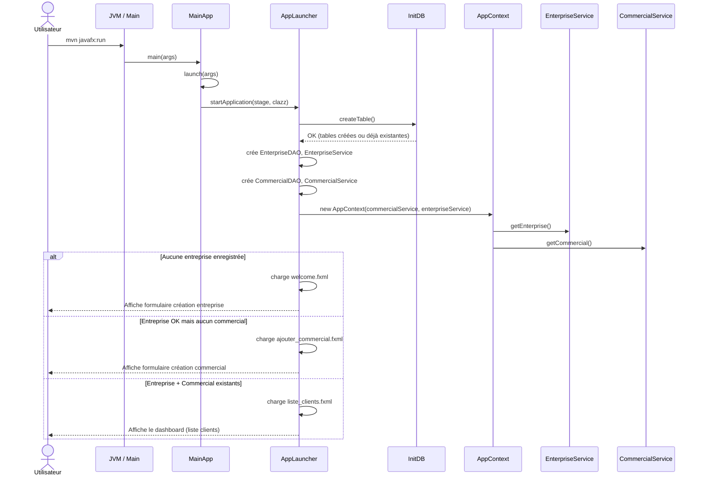

---

## 8. Diagramme de séquence — Ajout d'un client

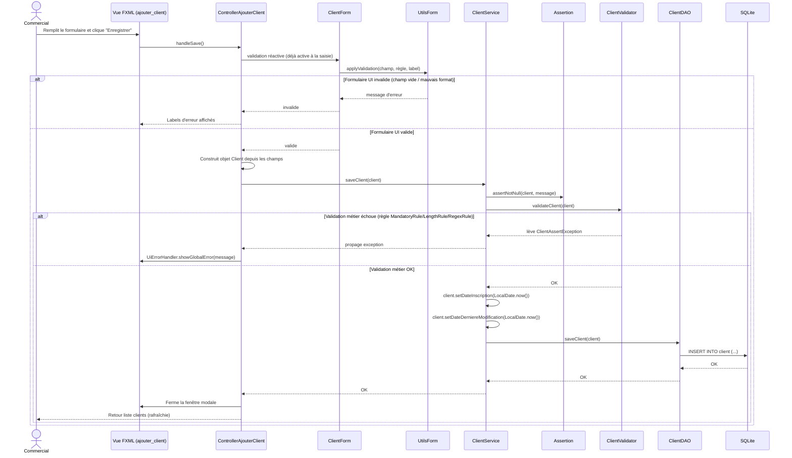

---

## 9. Diagramme de séquence — Liste clients et recherche

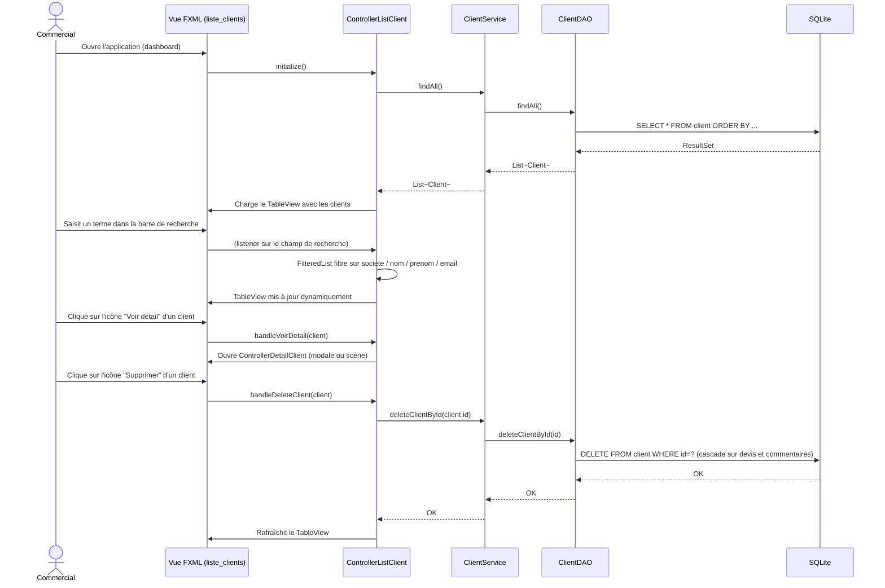

---

## 10. Diagramme de séquence — Détail client et ajout commentaire

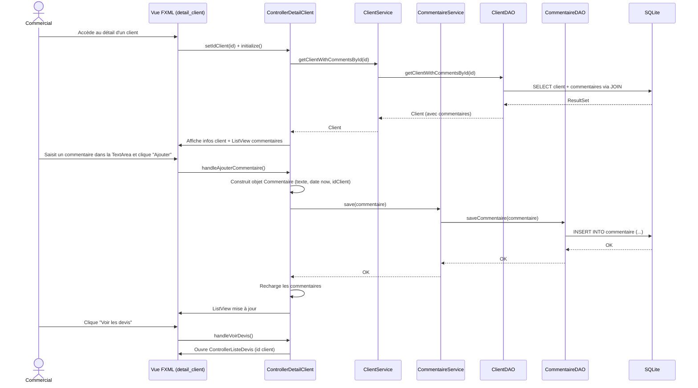

---

## 11. Diagramme de séquence — Modification d'un client

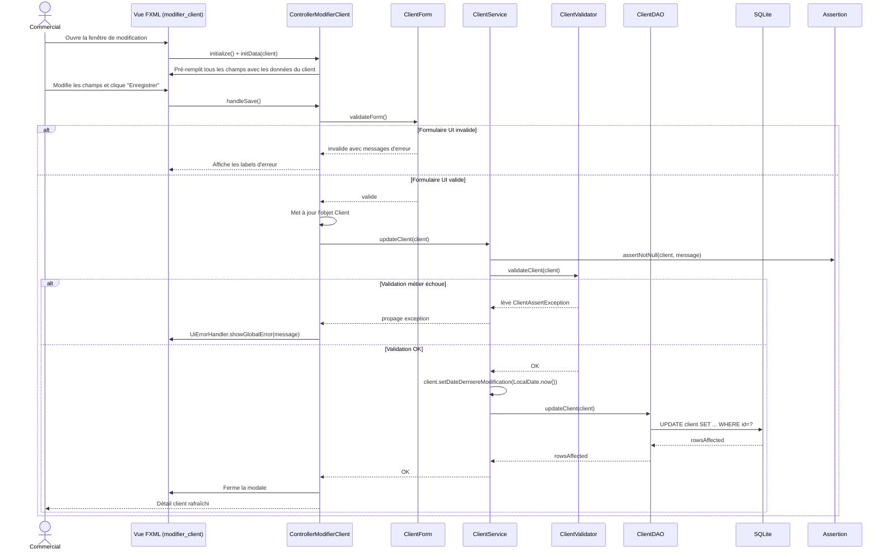

---

## 12. Diagramme de séquence — Ajout d'un devis

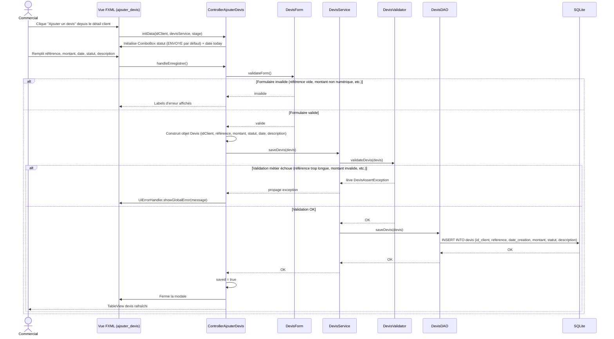

---

## 13. Diagramme de séquence — Modification et suppression d'un devis

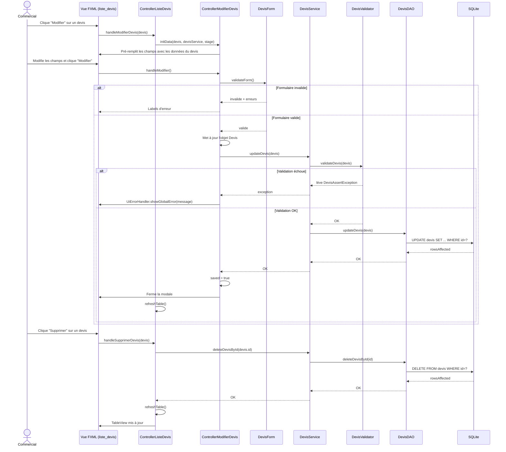

---

## 14. Diagramme de séquence — Saisie informations entreprise (premier lancement)

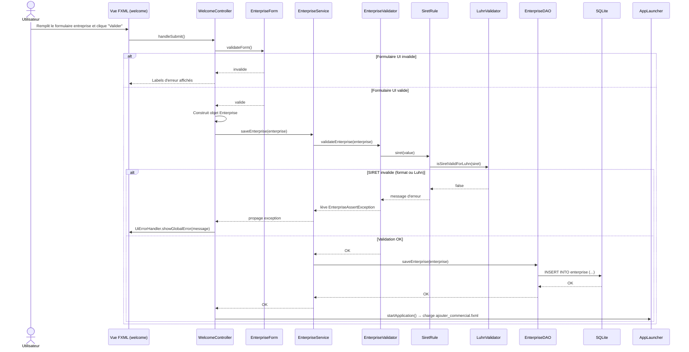
